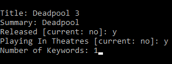
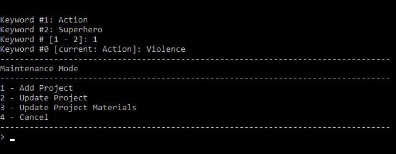
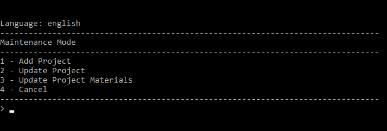
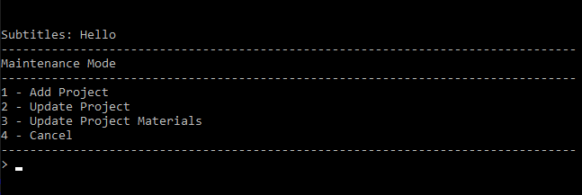
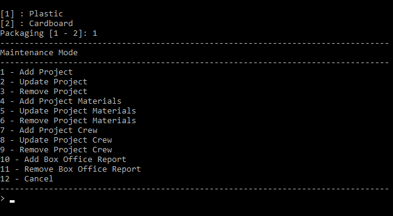
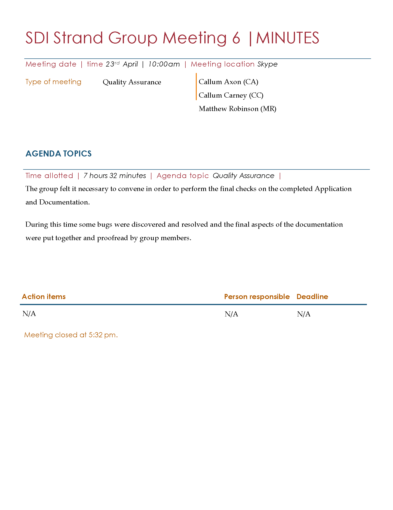

---
title: "Software Design and Implementation"
author: [Callum Axon (N0727303), Callum Carney (N0741707), Matthew Robinson (N0724629)]
subtitle: "TrekStar Software System"
lang: "en"
logo: "./images/ntu-logo.png"
linkcolor: darkgray
titlepage: true
titlepage-color: "06386e"
titlepage-text-color: "FFFFFF"
titlepage-rule-color: "FFFFFF"
titlepage-rule-height: 1
...

# Table of Contents

- [Table of Contents](#table-of-contents)
- [Todo - **_remove me before submission pls_**](#todo---remove-me-before-submission-pls)
	- [User Guide](#user-guide)
- [Contributions](#contributions)
	- [Callum Axon (N0727303) - Member A](#callum-axon-n0727303---member-a)
	- [Callum Carney (N0741707) - Member C](#callum-carney-n0741707---member-c)
	- [Matthew Robinson (N0724629) - Member B](#matthew-robinson-n0724629---member-b)
- [System Description](#system-description)
- [Class Diagram](#class-diagram)
	- [Cohesion and Coupling Considerations](#cohesion-and-coupling-considerations)
- [Sequence Diagram](#sequence-diagram)
- [State Diagram](#state-diagram)
- [Component Diagram](#component-diagram)
- [Deployment Diagram](#deployment-diagram)
	- [Individual Installation](#individual-installation)
	- [Company-Wide Installation](#company-wide-installation)
- [Design Pattern](#design-pattern)
- [Planned Architecture](#planned-architecture)
- [Included C++ Libraries](#included-c-libraries)
	- [JSON for C++ (GitHub Link)](#json-for-c-github-link)
	- [GTest (GitHub Link)](#gtest-github-link)
	- [spdlog (GitHub Link)](#spdlog-github-link)
- [Internal Data Structures](#internal-data-structures)
- [Search/Sorting Algorithm](#searchsorting-algorithm)
- [UI Screenshots](#ui-screenshots)
- [Software Testing Procedure](#software-testing-procedure)
- [User Manual](#user-manual)
	- [Software Introduction](#software-introduction)
	- [Using the Main Menu](#using-the-main-menu)
	- [Using View Mode](#using-view-mode)
		- [Using List Projects](#using-list-projects)
		- [Using Search Projects](#using-search-projects)
		- [Using List Materials](#using-list-materials)
	- [Using Maintenance Mode](#using-maintenance-mode)
		- [Using Add Project](#using-add-project)
		- [Using Update Project](#using-update-project)
			- [Edit Title](#edit-title)
			- [Edit Summary](#edit-summary)
			- [Edit Released](#edit-released)
			- [Edit Playing In Theaters](#edit-playing-in-theaters)
			- [Edit Existing Keywords](#edit-existing-keywords)
		- [Using Update Project Materials](#using-update-project-materials)
			- [Edit Audio Format](#edit-audio-format)
			- [Edit Run Time](#edit-run-time)
			- [Edit Language](#edit-language)
			- [Edit Retail Price](#edit-retail-price)
			- [Edit Subtitles](#edit-subtitles)
			- [Edit Frame Aspect](#edit-frame-aspect)
			- [Edit Packaging](#edit-packaging)
		- [Using Remove Project](#using-remove-project)
- [Conclusion](#conclusion)
- [Appendix](#appendix)
	- [Managing group work](#managing-group-work)
	- [Meeting Minutes](#meeting-minutes)

\newpage

# Todo - **_remove me before submission pls_**

## User Guide
  - [Using Maintenance Mode](#using-maintenance-mode) requires screenshot of the maintenance main menu when remove project is added.
  - User guide details required for when the application is able to manage crew and materials/projects fully.
  - Add back in image that shows keywords when adding a project when this is reimplemented.
  - Change all figure values where text is CHANGEFIGUREVALUE once all images added.
  - Complete [Using Update Project Materials](#using-update-project-materials) once the material id bug has been fixed.
  - Resolve image issue on [Edit Packaging](#edit-packaging) once bugs have been fixed
  - Look into new line for  # # # # headers

\newpage

# Contributions

## Callum Axon (N0727303) - Member A
* Implementation of the internal data structure for the application
* Class Diagram
* A description of how cohesion and coupling have been considered in the class design
* An explanation of the internal data structures used and the reason for the choices.
  
## Callum Carney (N0741707) - Member C
* Implementation of the data structure for the application
* Component Diagrams
* Deployment Diagrams
* An explanation of the search or sorting algorithm used

## Matthew Robinson (N0724629) - Member B
* Implementation of the Console Interface for the application
* Sequence diagram
* State machine diagram
* Screenshots of the User Interface

All other contributions have been completed as part of a group effort.

\newpage

# System Description

The Trekstar system has been developed in order to allow TrekStar Pictures to accomplish the following

- Create and Manage Projects including any relevant metadata
- Create and Manage Project Materials (single-sided DVDs, Blu-rays, etc)
- Create Projects that are "unreleased" and cannot be modified once created
- Include details in regards to the crew working on a Project

\newpage

# Class Diagram

Include class diagram here.

## Cohesion and Coupling Considerations

A justification and explanation of how cohesion and coupling have been considered in the
design. 

\newpage

# Sequence Diagram

Include sequence diagram here

\newpage

# State Diagram

Include state diagram here

\newpage

# Component Diagram

Include component diagram here

\newpage

# Deployment Diagram

There are two possible deployment scenarios for the TrekStar management system, these being:

1. An individual user will have the TrekStar project management system installed on their machine, using a locally stored JSON Database.
2. TrekStar Pictures will release the TrekStar project management system company-wide, using a shared JSON Database for each installation.

These two deployments are different due to the change in the data storage location, in which the latter will support company-wide collaboration through the application. 

However, no matter where the application is installed the following Operating Systems are supported:

* Windows
* Mac OS
* Linux

On the following pages you can find a visual representation of the aforementioned Deployment scenarios.

## Individual Installation

## Company-Wide Installation

\newpage

# Design Pattern

Include explanation of any design patterns used

\newpage

# Planned Architecture

An explanation of the planned architecture and the reason of the choices according to ATAM
(follow step 4 and 5, i.e., identify possible architecture styles and choose one with respect to
the identified utility tree, you need to explain the reason).

\newpage

# Included C++ Libraries

Within the TrekStar project management application we have used some C++ Libraries for parsing data, providing access to unit tests and including core functionality that would otherwise not be present. Below you can find an explanation of the included C++ libraries and why we chose to use them:

## JSON for C++ ([GitHub Link](https://github.com/nlohmann/json))
It was decided to use the JSON for C++ library within the application because we are using JSON as our database to store all of the users data. The JSON for C++ library allows us to parse JSON data, request data based on certain keys within a JSON Array or Object and create new JSON Arrays or Objects to be inserted into the database. The JSON for C++ library is quite easily the most feature complete and well documented library for parsing and creating JSON in C++, this was the main driving force behind using this library as we required something that is reliable and suitable for the applications use cases.

## GTest ([GitHub Link](https://github.com/google/googletest))
It was decided to use GTest as our primary unit testing library within the application, whilst we could have used Boost for unit testing, we decided that GTest had the following advantages which solidified our decision to use GTest:

- GTest is much more lightweight when compared to Boost, while GTest is specifically a testing library, Boost has more functionality that also needs to be imported to allow for the Unit Testing section of the library to function, consequently making it larger and less lightweight.
- When compared to other Unit Testing libraries there are more features that we can make use of in the project within GTest, for example, we can use GTests ability to mock objects, this is useful when we need to test the interaction between objects as we can achieve this more efficiently when compared to other libraries. We can also avoid duplication of test setup (creating objects, etc) within each unit test by specifying test fixtures which can be referenced within the unit tests.

## spdlog ([GitHub Link](https://github.com/gabime/spdlog))
It was decided to use spdlog for our logger library, when compared to other libraries spdlog is lightweight, fast and only requires header imports to get started. spdlog also supports all of the operating systems that our application has been developed to work on, which is an important feature to have.

spdlog also allows us to easily generate the required daily reports based on the data we pass from the JSON database, the simplicity of this library was an important consideration as it allows future developers to quickly understand how this function works incase a new feature or bug needs to be added/fixed.

\newpage

# Internal Data Structures

During the design phase of the TrekStar project management application it was decided that an internal data structure of Stack would be used. While there are pros and cons to each data structure, ultimately it was decided that the Stack data structure fit the best with the requirements of our application, you can find the in-depth reasoning behind the decision to use Stack below:

- The Stack data structure allows for the sequential ordering of disks, and make sense within our use cases. For example, if you have a box set of 4 disks and you would like to add a new disk, its likely that the new disk will be the latest episode, therefore it will be inserted sequentially at the end of the list. Another example would be when a user would like to remove a disk from a boxset, it is unlikely that you will want to remove the 3rd episode within the boxset, however if the 3rd episode was to be removed then the 4th episode (the last one in the underlying vector) can be removed allowing for the 3rd episode to then be removed, therefore the Stack data structure is still appropriate.
- Another advantage to the Stack data structure is that data can be accessed quicker sequentially, this is because you can iterate though the underlying vectors data finding items that a requested.
- A final advantage to the Stack data structure is that it uses general programming through the use of templating, as a consequence to this, the Stack data structure supports multiple types.

\newpage

# Search/Sorting Algorithm

Include explanation of the search/sorting algo used.

\newpage

# UI Screenshots

Include screenshots of console app here.

\newpage

# Software Testing Procedure
Software Testing is an important part of the SDLC and within our project we have multiple constraints in place to ensure that tested, bug-free code is committed to the GitHub repository. Committing working code to the repository is important for a number of reasons, with some of these being:

- Developers will never pull broken code that will lead to a slow down in development.
- Developers will never have to fix someone elses broken code, avoiding time wasted on parts of the application that is not allocated to that developers.
- In case of a rollback, the repository will always be in a good state, which helps to avoid further rollbacks.

Some of the constraints that we have in place are:

- Developers will only commit code that has the associated unit tests created and those unit tests must pass.
- Developers must never commit broken code that could impede the efficiency of other developers, if a commit is required a new branch should be created.
- If there are known bugs, developers must log these within the GitHub Issues to ensure that other developers know that it is know/being worked on incase they come across it.

Our group is confident that these constraints will allow us to develop the application with fewer interruptions and ensure that only high quality, tested code is being pushed to the repository. 

\newpage

# User Manual

## Software Introduction
The Trekstar project management application has been developed for TrekStar Pictures and allows them to create and manage Projects along with their associated product materials and metadata. This guide will cover how to use the core features of the application, which includes:

* Using the main menu
* Using view mode
* Using maintenance mode

## Using the Main Menu
To use the Main Menu, open the application and you will be presented with the following screen

Once on this screen, you can use the following keyboard inputs to navigate around the application, to find out more about each feature, click the associated information link.

| Input Value | Command Action                                                            | Information Link                                  |
| :----------: | ------------------------------------------------------------------------- | ------------------------------------------------- |
| 1     | Inputting this value will cause the application to enter View Mode        | [Using View Mode](#using-view-mode)               |
| 2     | Inputting this value will cause the application to enter Maintenance Mode | [Using Maintenance Mode](#using-maintenance-mode) |
| 3     | Inputting this value will cause the application to safely exit            | Not required                                      |

\newpage

## Using View Mode

Once you have reached the View Mode page you will be presented with the following screen

Once on this screen, you can use the following keyboard inputs to navigate around view mode, to find out more about each feature, click the associated information link.

| Input Value | Command Action                                                                     | Information Link                               |
| :----------: | ------------------------------------------------------------------------- | ---------------------------------------------- |
| 1     | Inputting this value will cause the application to list projects                   | [Listing Projects](#using-list-projects)       |
| 2     | Inputting this value will cause the application to enter search mode for projects | [Using Search Projects](#using-search-projects) |
| 3     | Inputting this value will cause the application to navigate back to the main menu | [Main Menu](#using-the-main-menu)         |

\newpage

### Using List Projects

Once you have entered the List Projects functionality you will be asked if you wish to sort all of the projects by their title, you can enter _`y`_ to confirm that you wish for the projects to be order by their titles and _`n`_ to decline.

You will now see the projects that are held within your applications database, you can see an example of this below.

As you can see in Figure CHANGEFIGUREVALUE, there are more options available to you, these options allow you to navigate through the projects. You can see the associated input actions below.

| Input Value | Command Action                                                                
| :----------: | ------------------------------------------------------------------------- |
| 1     | This will cause the application to move onto the next project in the database              |
| 2     | This will cause the application to move onto the previous project in the database | 
| 3     | This will cause the application to navigate back to [View Mode](#using-view-mode)              | 

\newpage

### Using Search Projects

Once you have entered the Search Projects functionality you will be asked to input a search query, this can be any value and data will only be returned if there is an associated project title held within the database.

You will now see the associated projects that matched to your search query, you can see an example of this below.

As you can see in Figure CHANGEFIGUREVALUE, there is the option to display the associated materials for this project, you can enter _`y`_ to confirm that you wish to view the materials for the associated project, which will bring up the following information:

As you can see in CHANGEFIGUREVALUE, there are more options available to you, these are the options associated with [View Mode](#using-view-mode), therefore you can find more information by reading the [View Mode](#using-view-mode) section of this user guide.

You can also enter _`n`_ to confirm that you do not want to view the materials for the associated project, which will bring up the following information:

As you can see in CHANGEFIGUREVALUE, there are more options available to you, these are the options associated with [View Mode](#using-view-mode), therefore you can find more information by reading the [View Mode](#using-view-mode) section of this user guide.

\newpage

### Using List Materials

Once you have entered the List Materials functionality you will be asked to input a Project ID, this must be a numeric value, you can find the accepted Project IDs above the input location, select an ID from this list.

You will now see the materials linked to the requested project that are held within your applications database, you can see an example of this below.

As you can see in Figure 10, there are more options available to you, these options allow you to navigate through the materials. You can see the associated input actions below.

| Input Value | Command Action                                                                
| :----------: | ------------------------------------------------------------------------- |
| 1     | This will cause the application to move onto the next material in the database              |
| 2     | This will cause the application to move onto the previous material in the database | 
| 3     | This will cause the application to navigate back to [View Mode](#using-view-mode)              | 

\newpage

## Using Maintenance Mode

Once you have reached the Maintenance Mode page you will be presented with the following screen

Once on this screen, you can use the following keyboard inputs to navigate around maintenance mode, to find out more about each feature, click the associated information link.

| Input Value | Command Action                                                                     | Information Link                               |
| :----------: | ------------------------------------------------------------------------- | ---------------------------------------------- |
| 1     | Inputting this value will cause the application to enter add project             | [Adding Projects](#using-add-project)       |
| 2     | Inputting this value will cause the application to enter update project | [Updating Projects](#using-update-project) |
| 3     | Inputting this value will cause the application to enter update project materials| [Updating Project Materials](#using-update-project-materials) |
| 4     | Inputting this value will cause the application to enter remove project | [Removing Projects](#using-remove-project) |
| 5     | Inputting this value will cause the application to navigate back to the main menu  | [Main Menu](#using-the-main-menu)         |

\newpage

### Using Add Project

Once you have entered the Add Project functionality you will be asked to enter the following information:

Firstly, you need to enter the Project Title, this is the name that you want your project to be called. Any value is accepted.

Next, you will be asked for a project summary. Any value is accepted.

Next, you will be asked if the project has been released. Only the values _`y`_ and _`n`_ are accepted. With _`y`_ confirming that the project has been released and _`n`_ confirming that the project has not been released.

Next, you will be asked if the project will be playing in theaters. Only the values _`y`_ and _`n`_ are accepted. With _`y`_ confirming that the project will be playing in theatres and _`n`_ confirming that the project will not be playing in theatres.

Next, you will be asked how many keywords you would like associating with the project. Any numeric value is accepted.

Finally, you will be asked what keywords you would like associated with the project, the amount of keyword requests depends on the previously entered numeric value. Any value is accepted.

As you can see in CHANGEFIGUREVALUE, there are more options available to you, these are the options associated with [Maintenance Mode](#using-maintenance-mode), therefore you can find more information by reading the [Maintenance Mode](#using-maintenance-mode) section of this user guide.

\newpage

### Using Update Project

Once you have entered the Update Project functionality you will be asked to enter the following information:

Firstly, you need to enter a Project ID, this must be a numeric value, you can find the accepted Project IDs above the input location, select an ID from this list.

Next, you will be presented with multiple options, you can use the following keyboard inputs to update certain aspects of the project, to find out more about each update, click the associated information link.

| Input Value | Command Action                                                                     | Information Link                               |
| :----------: | ------------------------------------------------------------------------- | ---------------------------------------------- |
| 1     | Inputting this value will cause the application to enter edit title             | [Edit Title](#edit-title)    |
| 2     | Inputting this value will cause the application to enter edit summary | [Edit Summary](#edit-summary) |
| 3     | Inputting this value will cause the application to enter edit released | [Edit Released](#edit-released) |
| 4     | Inputting this value will cause the application to enter edit playing in theatres | [Edit Playing In Theatres](#edit-playing-in-theaters) |
| 4     | Inputting this value will cause the application to enter edit existing keywords | [Edit Existing Keywords](#edit-existing-keywords) |
| 5     | Inputting this value will cause the application to navigate back to the maintenance mode menu  | [Maintenance Mode Menu](#using-maintenance-mode) |

\newpage

#### Edit Title

Once you have entered the Edit Title functionality you will be asked to enter the following information:

You need to enter the new Project Title, this is the new name that you want your project to be called. Any value is accepted.

As you can see in Figure CHANGEFIGUREVALUE, there are more options available to you, these are the options associated with [Maintenance Mode](#using-maintenance-mode), therefore you can find more information by reading the [Maintenance Mode](#using-maintenance-mode) section of this user guide.

\newpage

#### Edit Summary

Once you have entered the Edit Summary functionality you will be asked to enter the following information:

You need to enter the new Project Summary, this is the new summary that you want your project to have. Any value is accepted.

As you can see in Figure CHANGEFIGUREVALUE, there are more options available to you, these are the options associated with [Maintenance Mode](#using-maintenance-mode), therefore you can find more information by reading the [Maintenance Mode](#using-maintenance-mode) section of this user guide.

\newpage

#### Edit Released

Once you have entered the Edit Released functionality you will be asked to enter the following information:

You need to enter the new Released value, this is the new released state that you want your project to have. Only the values _`y`_ and _`n`_ are accepted. With _`y`_ confirming that the project is released and _`n`_ confirming that the project is not released.

As you can see in Figure CHANGEFIGUREVALUE, there are more options available to you, these are the options associated with [Maintenance Mode](#using-maintenance-mode), therefore you can find more information by reading the [Maintenance Mode](#using-maintenance-mode) section of this user guide.

\newpage

#### Edit Playing In Theaters

Once you have entered the Edit Playing In Theaters functionality you will be asked to enter the following information:

You need to enter the new playing in theatres value, this is the new playing in theaters state that you want your project to have. Only the values _`y`_ and _`n`_ are accepted. With _`y`_ confirming that the project will be playing in theatres and _`n`_ confirming that the project will not be playing in theatres.

As you can see in Figure CHANGEFIGUREVALUE, there are more options available to you, these are the options associated with [Maintenance Mode](#using-maintenance-mode), therefore you can find more information by reading the [Maintenance Mode](#using-maintenance-mode) section of this user guide.

\newpage

#### Edit Existing Keywords

Once you have entered the Edit Existing Keywords functionality you will be asked to enter the following information:

You need to enter the keyword identifier you wish to update, you can find the identifier in the provided list, an example of this can be seen below:

Once you have inputted a valid keyword identifier you will be asked to enter your new Keyword, any value is accepted.

As you can see in Figure CHANGEFIGUREVALUE, there are more options available to you, these are the options associated with [Maintenance Mode](#using-maintenance-mode), therefore you can find more information by reading the [Maintenance Mode](#using-maintenance-mode) section of this user guide.

\newpage

### Using Update Project Materials

Once you have entered the Update Project Materials functionality you will be asked to enter the following information:

Firstly, you need to enter a Project ID, this must be a numeric value, you can find the accepted Project IDs above the input location, select an ID from this list.

Next, you will be asked to enter the material identifer you wish to update within the previously selected project, you can find the identifier in the provided list, an example of this can be found below:

Next, you will be presented with multiple options, you can use the following keyboard inputs to update certain aspects of the material, to find out more about each update, click the associated information link.

| Input Value | Command Action                                                                     | Information Link                               |
| :----------: | ------------------------------------------------------------------------- | ---------------------------------------------- |
| 1     | Inputting this value will cause the application to enter edit audio format         | [Edit Audio Format](#edit-audio-format)    |
| 2     | Inputting this value will cause the application to enter edit run time | [Edit Run Time](#edit-run-time) |
| 3     | Inputting this value will cause the application to enter edit language | [Edit Language](#edit-language) |
| 4     | Inputting this value will cause the application to enter edit retail price | [Edit Retail Price](#edit-retail-price) |
| 5     | Inputting this value will cause the application to enter edit subtitles | [Edit Subtitles](#edit-subtitles) |
| 6     | Inputting this value will cause the application to enter edit frame aspect | [Edit Frame Aspect](#edit-frame-aspect) |
| 7     | Inputting this value will cause the application to enter edit packaging | [Edit Packaging](#edit-packaging) |
| 8     | Inputting this value will cause the application to navigate back to the maintenance mode menu  | [Maintenance Mode Menu](#using-maintenance-mode)      |

\newpage

#### Edit Audio Format

Once you have entered the Audio Format functionality you will be asked to enter the following information:

You need to enter the new Audio Format, this is the new audio format that you want your material to have. Any value is accepted.

As you can see in Figure CHANGEFIGUREVALUE, there are more options available to you, these are the options associated with [Maintenance Mode](#using-maintenance-mode), therefore you can find more information by reading the [Maintenance Mode](#using-maintenance-mode) section of this user guide.

\newpage

#### Edit Run Time

Once you have entered the Edit Run Time functionality you will be asked to enter the following information:

You need to enter the new Run Time, this is the new run time that you want your material to have. Any numeric value is accepted.

As you can see in Figure CHANGEFIGUREVALUE, there are more options available to you, these are the options associated with [Maintenance Mode](#using-maintenance-mode), therefore you can find more information by reading the [Maintenance Mode](#using-maintenance-mode) section of this user guide.

\newpage

#### Edit Language

Once you have entered the Edit Language functionality you will be asked to enter the following information:

You need to enter the new Language, this is the new language that you want your material to have. Any value is accepted.

As you can see in Figure CHANGEFIGUREVALUE, there are more options available to you, these are the options associated with [Maintenance Mode](#using-maintenance-mode), therefore you can find more information by reading the [Maintenance Mode](#using-maintenance-mode) section of this user guide.

\newpage

#### Edit Retail Price

Once you have entered the Edit Retail Price functionality you will be asked to enter the following information:

You need to enter the new Retail Price, this is the new retail price that you want your material to have. Any numeric value is accepted.

As you can see in Figure CHANGEFIGUREVALUE, there are more options available to you, these are the options associated with [Maintenance Mode](#using-maintenance-mode), therefore you can find more information by reading the [Maintenance Mode](#using-maintenance-mode) section of this user guide.

\newpage

#### Edit Subtitles

Once you have entered the Edit Subtitles functionality you will be asked to enter the following information:

You need to enter the new Subtitles, this is the new subtitles that you want your material to have. Any value is accepted.

As you can see in Figure CHANGEFIGUREVALUE, there are more options available to you, these are the options associated with [Maintenance Mode](#using-maintenance-mode), therefore you can find more information by reading the [Maintenance Mode](#using-maintenance-mode) section of this user guide.

\newpage

#### Edit Frame Aspect

Once you have entered the Edit Frame Aspect functionality you will be asked to enter the following information:

You need to enter the new Frame Aspect, this is the new frame aspect that you want your material to have. Any value is accepted.

As you can see in Figure CHANGEFIGUREVALUE, there are more options available to you, these are the options associated with [Maintenance Mode](#using-maintenance-mode), therefore you can find more information by reading the [Maintenance Mode](#using-maintenance-mode) section of this user guide.

\newpage

#### Edit Packaging

Once you have entered the Edit Packaging functionality you will be asked to enter the following information:

You need to enter the new Packaging details, this is the new packaging information that you want your material to have. Any value is accepted.

As you can see in Figure CHANGEFIGUREVALUE, there are more options available to you, these are the options associated with [Maintenance Mode](#using-maintenance-mode), therefore you can find more information by reading the [Maintenance Mode](#using-maintenance-mode) section of this user guide.

\newpage

### Using Remove Project

todo

\newpage

# Conclusion

Discussion and conclusion about your results (reflection on testing approach, reflection on
performance such as computational efficiency, reliability, security, portability, maintainability,
scalability, etc. design of system complexity using e.g. big O- notation).

\newpage

# Appendix

## Managing group work

 Whilst working on this project our group used a multitude of methods to ensure that we were collaborating efficiently and getting the most amount of work completed as possible, these methods included, but are not limited to:

 - Using Facebook Messenger to converse with other group members about certain aspects of the program or documentation, this allowed us to keep in touch and ensure we were on track with the workload.
 - Using GitHub to its full potential, this includes the use of GitHub Issues and Pull Requests in conjunction with code reviews for each major feature. Whenever a bug or issue was discovered the group member that uncovered the issue would create a GitHub issue. If the bug was within another group members individual work then that member would be added as a participant so that they could fix the issue. Once large features were added to the program, pull requests were used with each group member being requested to review the code before merging into the master branch.

Overall, our experience of working as a group has been productive and enjoyable, being able to distribute the workload across group members was an important aspect to the project and allowed us to complete it efficiently. We have all taken learning points from this experience that could be applied to the workplace, or even in our upcoming placements. For example:

- The use of GitHub's features (such as pull requests, issues and code reviewing) will be an excellent skill to have within the workplace, as more often than not, organisations will have some sort of code review system/Quality Assurance (QA) procedure in place and being able to understand how this all works without training will show that you are a competent employee.
- The use of a messaging platform was also important, sometimes organisations have employees working across the globe and having the ability to efficiently collaborate on messaging systems (such as Slack) is an important skill to have. 

## Meeting Minutes

During group meetings a member was nominated to write minutes, these minutes were an important factor during the development of the application as they allowed us to go back and check what work we have all be allocated. On the following pages you can find the minutes for the aforementioned meetings.

