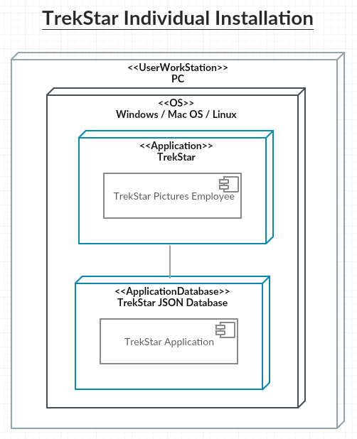
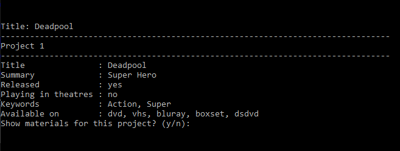

---
title: "Software Design and Implementation"
author: [Callum Axon (N0727303), Callum Carney (N0741707), Matthew Robinson (N0724629)]
date: "2019-04-28"
subtitle: "TrekStar Software System"
lang: "en"
linkcolor: darkgray
titlepage: true
titlepage-color: "06386e"
titlepage-text-color: "FFFFFF"
titlepage-rule-color: "FFFFFF"
titlepage-rule-height: 1
...

# Table of Contents

- [Table of Contents](#table-of-contents)
- [Todo - **_remove me before submission pls_**](#todo---remove-me-before-submission-pls)
- [Contributions](#contributions)
	- [Callum Axon (N0727303)](#callum-axon-n0727303)
	- [Callum Carney (N0741707)](#callum-carney-n0741707)
	- [Matthew Robinson (N0724629)](#matthew-robinson-n0724629)
- [System Description](#system-description)
- [Class Diagram](#class-diagram)
	- [Cohesion and Coupling Considerations](#cohesion-and-coupling-considerations)
- [Sequence Diagram](#sequence-diagram)
- [State Diagram](#state-diagram)
- [Component Diagram](#component-diagram)
- [Deployment Diagram](#deployment-diagram)
	- [Individual Installation](#individual-installation)
	- [Company-Wide Installation](#company-wide-installation)
- [Design Pattern](#design-pattern)
- [Planned Architecture](#planned-architecture)
- [Included C++ Libraries](#included-c-libraries)
- [Internal Data Structures](#internal-data-structures)
- [Search/Sorting Algorithm](#searchsorting-algorithm)
- [UI Screenshots](#ui-screenshots)
- [Software Testing Prodcedure](#software-testing-prodcedure)
- [User Manual](#user-manual)
	- [Software Introduction](#software-introduction)
	- [Using the Main Menu](#using-the-main-menu)
	- [Using View Mode](#using-view-mode)
		- [Using List Projects](#using-list-projects)
		- [Using Search Projects](#using-search-projects)
		- [Using List Materials](#using-list-materials)
	- [Using Maintenance Mode](#using-maintenance-mode)
		- [Using Add Project](#using-add-project)
		- [Using Remove Projects](#using-remove-projects)
- [Conclusion](#conclusion)
- [Appendix](#appendix)

\newpage

# Todo - **_remove me before submission pls_**
- [Using List Materials](#using-list-materials) requires screenshot that shows projectid listings when id issue is resolved.
- [Using Maintenance Mode](#using-maintenance-mode) requires screenshot of the maintenance main menu when remove project is added.
- User guide details required for when the application is able to manage crew and materials/projects fully.
- Update [Using Add Project](#using-add-project) to reflect changes to saving a project.
\newpage

# Contributions

## Callum Axon (N0727303)
* Stuff

## Callum Carney (N0741707)
* Other Stuff

## Matthew Robinson (N0724629)
* More Stuff

\newpage

# System Description

The Trekstar system has been developed in order to allow TrekStar Pictures to accomplish the following

- Create and Manage Projects including any relevant metadata
- Create and Manage Project Materials (single-sided DVDs, Blu-rays, etc)
- Create Projects that are "unreleased" and cannot be modified once created
- Include details in regards to the crew working on a Project

\newpage

# Class Diagram

Include class diagram here.

## Cohesion and Coupling Considerations

A justification and explanation of how cohesion and coupling have been considered in the
design. 

\newpage

# Sequence Diagram

Include sequence diagram here

\newpage

# State Diagram

Include state diagram here

\newpage

# Component Diagram

Include component diagram here

\newpage

# Deployment Diagram

There are two possible deployment scenarios for the TrekStar management system, these being:

1. An indivdual user will have the TrekStar project management system installed on their machine, using a locally stored JSON Database.
2. TrekStar Pictures will release the TrekStar project management system company-wide, using a shared JSON Database for each installation.

These two deployments are different due to the change in the data storage location, in which the latter will support company-wide collaboration through the application. 

However, no matter where the application is installed the following Operating Systems are supported:

* Windows
* Mac OS
* Linux

On the following pages you can find a visual representation of the aformentioned Deployment scenarios.

## Individual Installation

## Company-Wide Installation

\newpage

# Design Pattern

Include explaination of any design patterns used

\newpage

# Planned Architecture

An explanation of the planned architecture and the reason of the choices according to ATAM
(follow step 4 and 5, i.e., identify possible architecture styles and choose one with respect to
the identified utility tree, you need to explain the reason).

\newpage

# Included C++ Libraries

Include explaination of any C++ Libraries used

\newpage

# Internal Data Structures

Include explaination of what internal data structures were used.

\newpage

# Search/Sorting Algorithm

Include explaination of the search/sorting algo used.

\newpage

# UI Screenshots

Include screenshots of console app here.

\newpage

# Software Testing Prodcedure

Include explaination of software testing procedure here.

\newpage

# User Manual

## Software Introduction
The Trekstar project management application has been developed for TrekStar Pictures and allows them to create and manage Projects along with their associated product materials and metadata. This guide will cover how to use the core features of the application, which includes:

* Using the main menu
* Using view mode
* Using maintenance mode

## Using the Main Menu
To use the Main Menu, open the application and you will be presented with the following screen

Once on this screen, you can use the following keyboard inputs to navigate around the application, to find out more about each feature, click the associated information link.

| Input Value | Command Action                                                            | Information Link                                  |
| :----------: | ------------------------------------------------------------------------- | ------------------------------------------------- |
| 1     | Inputting this value will cause the application to enter View Mode        | [Using View Mode](#using-view-mode)               |
| 2     | Inputting this value will cause the application to enter Maintenance Mode | [Using Maintenance Mode](#using-maintenance-mode) |
| 3     | Inputting this value will cause the application to safely exit            | Not required                                      |

\newpage

## Using View Mode

Once you have reached the View Mode page you will be presented with the following screen

Once on this screen, you can use the following keyboard inputs to navigate around view mode, to find out more about each feature, click the associated information link.

| Input Value | Command Action                                                                     | Information Link                               |
| :----------: | ------------------------------------------------------------------------- | ---------------------------------------------- |
| 1     | Inputting this value will cause the application to list projects                   | [Listing Projects](#using-list-projects)       |
| 2     | Inputting this value will cause the application to enter search mode for materials | [Using Search Projects](#using-search-projects) |
| 3     | Inputting this value will cause the application to list materials                  | [Listing Materials](#using-list-materials) |
| 4     | Inputting this value will cause the application to navigate back to the [Main Menu](#using-the-main-menu)  | Not required           |

\newpage

### Using List Projects

Once you have entered the List Projects functionality you will be asked if you wish to sort all of the projects by their title, you can enter _`y`_ to confirm that you wish for the projects to be order by their titles and _`n`_ to decline.

You will now see the projects that are held within your applications database, you can see an example of this below.

As you can see in Figure 6, there are more options avaliable to you, these options allow you to navigate through the projects. You can see the associated input actions below.

| Input Value | Command Action                                                                
| :----------: | ------------------------------------------------------------------------- |
| 1     | This will cause the application to move onto the next project in the database              |
| 2     | This will cause the application to move onto the previous project in the database | 
| 3     | This will cause the application to navigate back to [View Mode](#using-view-mode)              | 

\newpage

### Using Search Projects

Once you have entered the Search Projects functionality you will be asked to input a search query, this can be any value and data will only be returned if there is an associated project title held within the database.

You will now see the associated projects that matched to your search query, you can see an example of this below.

As you can see in Figure 8, there are more options avaliable to you, these are the options associated with [View Mode](#using-view-mode), therefore you can find more information by reading the [View Mode](#using-view-mode) section of this user guide.

\newpage

### Using List Materials

Once you have entered the List Materials functionality you will be asked to input a Project ID, this must be a numeric value, you can find the accepted Project IDs above the input location, select an ID from this list.

You will now see the materials linked to the requested project that are held within your applications database, you can see an example of this below.

As you can see in Figure 10, there are more options avaliable to you, these options allow you to navigate through the materials. You can see the associated input actions below.

| Input Value | Command Action                                                                
| :----------: | ------------------------------------------------------------------------- |
| 1     | This will cause the application to move onto the next material in the database              |
| 2     | This will cause the application to move onto the previous material in the database | 
| 3     | This will cause the application to navigate back to [View Mode](#using-view-mode)              | 

\newpage

## Using Maintenance Mode

Once you have reached the Maintenance Mode page you will be presented with the following screen

Once on this screen, you can use the following keyboard inputs to navigate around maintenance mode, to find out more about each feature, click the associated information link.

| Input Value | Command Action                                                                     | Information Link                               |
| :----------: | ------------------------------------------------------------------------- | ---------------------------------------------- |
| 1     | Inputting this value will cause the application to enter add project             | [Adding Projects](#using-add-project)       |
| 2     | Inputting this value will cause the application to enter remove project | [Removing Projects](#using-remove-projects) |
| 3     | Inputting this value will cause the application to save all changes to the database           | Not required |
| 4     | Inputting this value will cause the application to navigate back to the [Main Menu](#using-the-main-menu)  | Not required           |

\newpage

### Using Add Project

Once you have entered the Add Project functionality you will be asked to enter the following information:

Project Title, this is the name that you want your project to be called. Any value is accepted.

Next, you will be asked if the project has been released. Only the values _`y`_ and _`n`_ are accepted. With _`y`_ confirming that the project has been released and _`n`_ confirming that the project has not been released.

Next, you will be asked if the project will be playing in theaters. Only the values _`y`_ and _`n`_ are accepted. With _`y`_ confirming that the project will be playing in theatres and _`n`_ confirming that the project will not be playing in theatres.

Next, you will be asked how many keywords you would like associating with the project. Any numeric value is accepted.

Finally, you will be asked what keywords you would like associated with the project, the amount of keywords requests depends on the previously entered numeric value. Any value is accepted.

As you can see in Figure 16, there are more options avaliable to you, these are the options associated with [Maintenance Mode](#using-maintenance-mode), therefore you can find more information by reading the [Maintenance Mode](#using-maintenance-mode) section of this user guide.

\newpage

### Using Remove Projects

todo

\newpage

# Conclusion

Discussion and conclusion about your results (reflection on testing approach, reflection on
performance such as computational efficiency, reliability, security, portability, maintainability,
scalability, etc. design of system complexity using e.g. big O- notation).

\newpage

# Appendix

\newpage